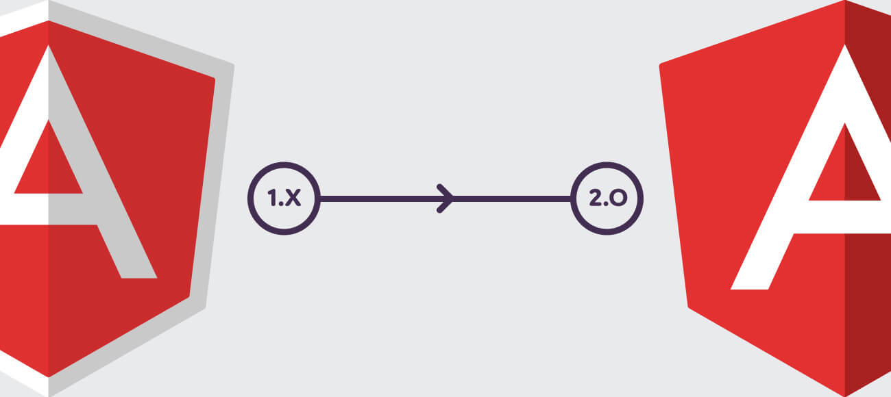

# Angular 프레임워크(Framework)

## 소개

[Angular][1]는 JavaScript 기반의 오픈 소스 Front-End 웹 애플리케이션 프레임워크[^1]입니다.
초기 버전인 AngularJS는 2010년 발표되었고, Angular 1으로 부릅니다. 2016년 9월 Angular 2가 정식으로 발표되면서 AngularJS가 아닌, Angular로 이름을 통칭하기로 결정합니다. 현재(2018년 6월) Angular 6가 나온 상태입니다.

Google은 Angular를 단지 웹 프레임워크로만 사용하는 기술이 아닌, 모든 플랫폼에서 활용 가능한 형태로 발전시키고자 합니다.

## AngularJS(1.x.x)와의 차이점

- **Components 기반 개발 방식** ⬅︎ Controllers, $scope 기반 개발 방식
- **TypeScript 도입**
- **Angular CLI 개발환경 지원 도구** 제공

 

## 브라우저 호환성

대부분의 모던 프레임워크가 그렇듯 Angular 또한 **IE 9 이상** 지원합니다.

## 학습이 쉽지 않은 이유

Angular는 배우기 쉽지 않습니다. **최소한으로 요구하는 사전 지식 수준이 높기 때문**입니다.
필수적으로 JavaScript, ECMAScript 2015+, TypeScript, 객체 지향 프로그래밍(OOP), Front-End 개발 도구를 사용할 수 있는 지식을 갖춰야 합니다.

- **JavaScript / ECMAScript 2015+** 언어에 대한 이해
- **TypeScript** 언어에 대한 이해
- **객체 지향 프로그래밍**에 대한 이해
- **Front-End 개발 도구** (npm, sass, babel, webpack, gulp, rollup 등) 활용

 

---

[^1]: 동적인 웹 페이지나, 웹 애플리케이션, 웹 서비스 개발 보조용으로 만들어지는 애플리케이션 프레임워크의 일종으로, 웹 페이지를 개발하는 과정에서 겪는 어려움을 줄이는 것이 주 목적으로 통상 데이터베이스 연동, 템플릿 형태의 표준, 세션 관리, 코드 재사용 등의 기능을 포함하고 있습니다. [Wiki 참고](https://ko.wikipedia.org/wiki/%EC%9B%B9_%ED%94%84%EB%A0%88%EC%9E%84%EC%9B%8C%ED%81%AC)

[1]: https://angular.io