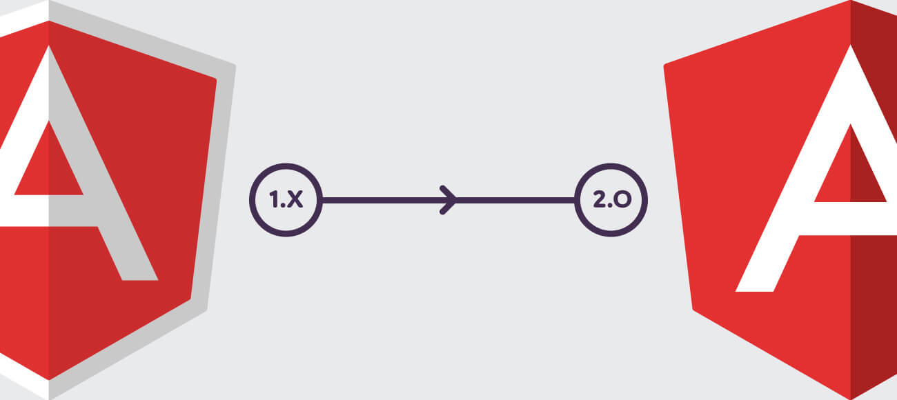
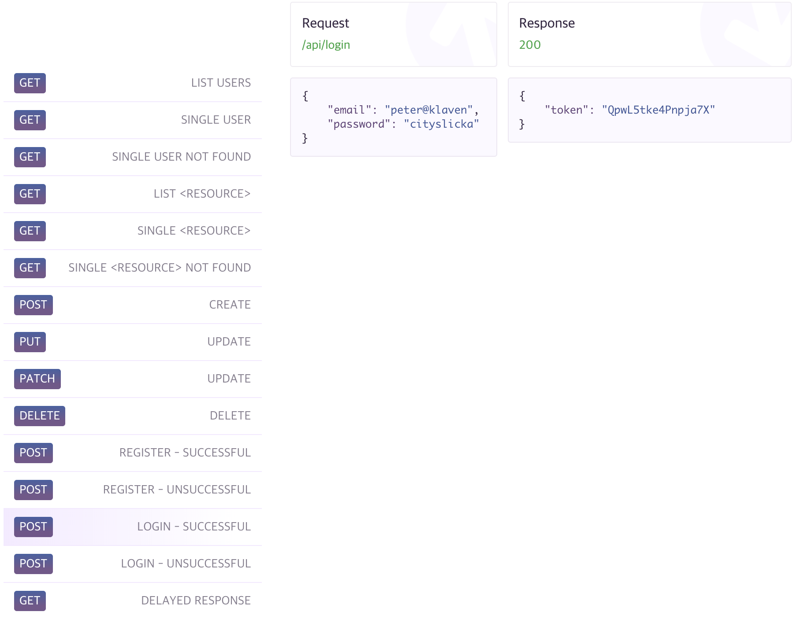

# Angular 프레임워크

## 소개


[Angular](https://angular.io)는 JavaScript 기반의 오픈 소스 Front-End 웹 애플리케이션 프레임워크입니다. 초기 버전인 AngularJS는 2010년 발표되었고, Angular 1으로 부릅니다. 

2016년 9월 Angular 2가 정식으로 발표되면서 AngularJS가 아닌, Angular로 이름을 통칭 하기로 결정합니다. 현재\(2018년 7월\) Angular 6가 나온 상태입니다. Google은 Angular를 웹 프레임 워크를 넘어, 모든 플랫폼에서 활용 가능한 형태로 발전 시키고자 합니다.

## AngularJS  vs  Angular

* **Components 기반 개발 방식** ⬅︎ Controllers, $scope 기반 개발 방식
* **TypeScript 도입**
* **Angular CLI 개발환경 지원 도구** 제공





## 학습이 쉽지 않은 이유

Angular는 배우기 쉽지 않습니다. **최소한으로 요구하는 사전 지식 수준이 높기 때문**입니다. 필수적으로 JavaScript, ECMAScript 2015+, TypeScript, 객체 지향 프로그래밍\(OOP\), Front-End 개발 도구를 사용할 수 있는 지식을 갖춰야 합니다.

* **JavaScript / ECMAScript 2015+** 언어에 대한 이해
* **TypeScript** 언어에 대한 이해
* **객체 지향 프로그래밍**에 대한 이해
* **Front-End 개발 도구** \(npm, sass, babel, webpack, gulp, rollup 등\) 활용


## 브라우저 호환성

대부분의 모던 프레임워크가 그렇듯 [Angular 또한 **IE 9 이상** 지원](https://angular.io/guide/browser-support)합니다. 


#### 폴리필\(Polyfill\)

Angular 프레임워크는 최신 웹 플랫폼 표준을 따릅니다. 이에 따라 오래된 브라우저에서는 모든 기능을 지원하지 않으니 프레임워크 선택 전에 충분히 고려해야 합니다. 물론, Angular 팀은 오래된 브라우저에서도 Angular를 사용할 수 있도록 폴리필 방법을 제공합니다.

#### 브라우저 별, 요구되는 폴리필

| **브라우저 \(Desktop / Mobile\)** | **요구되는 폴리필** |
| --- | --- | --- | --- |
| Chrome, Firefox, Edge, Safari 9+ | [ES7/reflect](https://angular.io/guide/browser-support#core-es7-reflect) \(JIT 사용 시\) |
| Safari 7/8, IE10/11, Android 4.1+ | [ES6](https://angular.io/guide/browser-support#core-es6) |
| IE9 | [ES6 classList](https://angular.io/guide/browser-support#classlist) |


폴리필은 폴리\(Poly\) + 필\(Fill\)의 합성어로 "다양하게 채우다"는 의미로 해석될 수 있습니다. 최신 기술을 지원하지 않는 구형 브라우저에서 지원할 수 있도록 JavaScript, CSS로 대체하는 방법을 말합니다. 단, 폴리필을 사용해 구형 브라우저에서도 지원하게 구현할 수는 있지만, 속도는 저하될 수 있습니다.


다음 챕터에서 공부하는 [Angular CLI](https://uid.gitbook.io/angular/angular-cli)를 사용하면 자동으로 프로젝트를 구성해주는데, `src/polyfills.ts` 파일이 Angular 프로젝트 시, 오래된 브라우저를 고려하여 폴리필을 사용할 수 있도록 합니다. 이 파일에는 많은 수의 ​​폴리필이 ECMAScript `import` 문으로 구성되어 있습니다.

일부 폴리필은 NPM 명령을 통해 설치가 필요합니다. 예를 들어, 프로젝트에 [웹 애니메이션 polyfill](http://caniuse.com/#feat=web-animation)이 필요한 경우 다음 명령을 통해 필요한 개발 모듈을 설치해야 합니다.

```bash
$ npm install --save web-animations-js
```


Angular 애플리케이션에서 [AnimationBuilder](https://angular.io/api/animations/AnimationBuilder)를 사용하고, IE/Edge, Safari를 고려할 경우에만 필요합니다. Angular의 표준 애니메이션 지원은 더 이상 폴리필이 필요하지 않습니다 \(Angular 6.0 기준\).


## 개발 IDE

웹 애플리케이션 개발을 위한 IDE\(통합 개발 환경\)로 Visual Studio Code 또는 VS Code와 동일한 사용자 경험을 제공하는 온라인 에디터를 사용합니다.

{% embed data="{\"url\":\"https://code.visualstudio.com/\",\"type\":\"link\",\"title\":\"Visual Studio Code - Code Editing. Redefined\",\"description\":\"Visual Studio Code is a code editor redefined and optimized for building and debugging modern web and cloud applications.  Visual Studio Code is free and available on your favorite platform - Linux, macOS, and Windows.\",\"icon\":{\"type\":\"icon\",\"url\":\"https://code.visualstudio.com/favicon.ico\",\"width\":128,\"height\":128,\"aspectRatio\":1},\"thumbnail\":{\"type\":\"thumbnail\",\"url\":\"http://code.visualstudio.com/opengraphimg/opengraph-home.png\",\"width\":1223,\"height\":630,\"aspectRatio\":0.5151267375306623},\"caption\":\"오프라인 IDE\"}" %}



