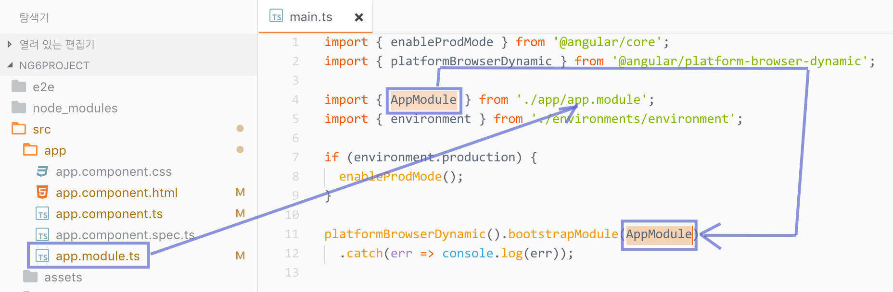
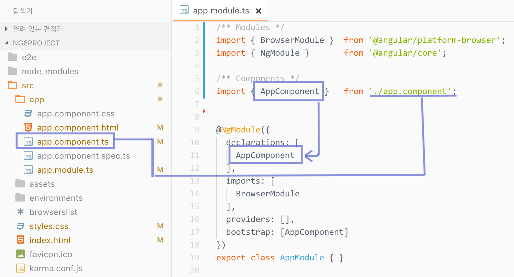
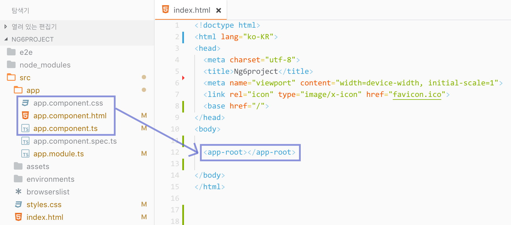

## 엔트리 포인트(Entry Point)

프로젝트 루트 디렉토리에 위치한 HTML 파일은 애플리케이션의 인덱스 페이지에 해당됩니다. 필요한 경우 애플리케이션 개발에 필요한 리소스 등을 추가적으로 설정하거나 변경할 수 있습니다.

`/index.html` 파일:

```html
<!doctype html>
<html lang="ko-KR">
<head>
  <meta charset="utf-8">
  <title>Angular 6 아키텍쳐</title>
  <meta name="viewport" content="width=device-width, initial-scale=1">
  <link rel="icon" type="image/x-icon" href="favicon.ico">
  <base href="/">
</head>
<body>

  <!--
    Angular 프레임워크 라우팅을 통해 동적으로 페이지가 생성됩니다.
    <app-root> 뷰(View)에 대응하는 컴포넌트는 app.component.ts 파일입니다.
  -->
  <app-root></app-root>

</body>
</html>
```

### 모듈(Modules)

루트 디렉토리에 위치한 `/main.ts` 파일은 Angular 애플리케이션의 기본 엔트리 포인트[^1]입니다.
JIT[^2] 컴파일러로 애플리케이션을 컴파일 한 후, 루트 모듈[^3]인(`AppModule`)을 부트스트랩[^2]하여 웹 브라우저에서 실행합니다. 코드를 살펴보면 `AppModule` 파일을 불러와 부트스트랩 모듈에 설정합니다.

`/main.ts` 파일:

```ts
import { enableProdMode }         from "@angular/core";
import { platformBrowserDynamic } from '@angular/platform-browser-dynamic';

import { AppModule }              from './app/app.module'; // ⬅⬅⬅ 루트 모듈
import { environment }            from './environments/environment';

if (environment.production) { enableProdMode() }

// AppModule을 불러들여 부트스트랩 모듈에 설정
platformBrowserDynamic().bootstrapModule(AppModule)
  .catch(err => console.log(err));
```

이해가 잘 안되면 그림을 살펴보세요.

> `src/main.ts` ⬅︎ `src/app/app.module.ts`



### 부트스트래핑(Bootstrapping)

`main.ts` 파일로부터 호출되는 `app.module.ts` 모듈 파일은 `/app` 디렉토리 내에 위치해 있습니다.
코드를 살펴보면 `NgModule` 모듈을 불러와 `AppComponent` 컴포넌트를 선언, [부트스트래핑](https://angular.io/guide/bootstrapping)[^4] 합니다.

`/app/app.module.ts` 파일:

```ts
// BrowserModule은 웹 브라우저를 위한 모듈
// 웹 애플리케이션 프로젝트일 경우, 반드시 로드해야 함.
import { BrowserModule } from '@angular/platform-browser';
import { NgModule }      from '@angular/core';

// 컴포넌트 로드
import { AppComponent }  from './app.component';

// NgModule 데코레이터에 메타데이터 설정
@NgModule({
  // 사용할 컴포넌트, 디렉티브, 파이프 등록
  //  컴포넌트를 "선언"에 추가해야 사용 가능
  declarations: [
    AppComponent
  ],
  // 필요한 모듈 등록
  //  예) BrowserModule, FormsModule, HttpModule 등
  imports: [
    // 브라우저 모듈
    BrowserModule
  ],
  // 서비스 등록
  //  이 곳에 등록된 서비스는 모든 컴포넌트에서 접근 사용 가능
  providers: [],
  // 부트스트래핑
  //  컴포넌트 트리를 구성하는 루트 컴포넌트 설정
  //  필요한 경우 2개 이상 설정 가능하지만,
  //  일반적으로 1개의 루트 컴포넌트 설정
  bootstrap: [AppComponent]
})
export class AppModule { }
```

이해가 잘 안되면 그림을 살펴보세요.

> `src/app/app.module.ts` ⬅︎ `src/app/app.component.ts`



### 컴포넌트(Components)

`AppComponent` 컴포넌트[^5]는 `app.component.ts` 파일에 정의되어 있습니다.
코드를 살펴보면 컴포넌트 모듈을 불러와 메타데이터를 입력하고, 클래스로 컴포넌트를 내보냅니다.
여기서 내보내진 클래스는 `main.ts`에서 `AppComponent`로 불러와 사용됩니다.

`./app/app.component.ts` 파일:

```ts
// 컴포넌트 데코레이트를 사용하기 위한 모듈 로드
import { Component } from '@angular/core';

// 컴포넌트 데코레이터에 메타데이터 설정
@Component({
  selector: 'app-root',                // <app-root> 커스텀 요소 이름
  templateUrl: './app.component.html', // HTML 템플릿 파일
  styleUrls: ['./app.component.css']   // CSS 스타일링 리스트
})
export class AppComponent {
  title = 'Angular 프론트엔드 애플리케이션';
}
```

컴포넌트 데코레이터에 설정된 메타데이터는 커스텀 요소 선택자, 템플릿, 스타일링 입니다.

- `seelctor`: 컴포넌트에서 사용할 커스텀 요소(`<app-root>`)의 이름입니다.
- `templateUrl`: 컴포넌트 템플릿 HTML파일의 경로를 설정합니다.
- `styleUrls`: 컴포넌트 스타일 CSS 파일 리스트(배열)로 각 파일의 경로를 설정합니다.


이해를 돕자면, 인덱스 페이지에 사용된 `<app-root>` 컴포넌트를 구성하는 파일의 위치는 다음과 같습니다.

> `src/index.html` ⬅︎ `src/app/app.component.{html,css,ts}`



<br>

---

[^1]: 프로그램 코드를 진입해서 실행하는 파일을 말합니다. [Wiki 참고](https://ko.wikipedia.org/wiki/%EC%97%94%ED%8A%B8%EB%A6%AC_%ED%8F%AC%EC%9D%B8%ED%8A%B8)
[^2]: Just-In-Time 컴파일러는 Angular HTML, TypeScript 코드를 부트스트래핑의 일부이며 런타임에 효율적인 JavaScript 코드로 변경합니다. [Angular API 사전 참고](https://angular.io/guide/glossary#jit)
[^3]: 독립성이 보장되는 별도의 코드 묶음으로 이해할 수 있습니다. [Wiki 참고](https://goo.gl/r7KRML)
[^4]: 애플리케이션이 초기 구동되기 위한 과정을 말합니다.
[^5]: 소프트웨어를 구성하는 컴포넌트는 조립 가능한 작은 단위입니다. [Wiki 참고](https://ko.wikipedia.org/wiki/%EC%BB%B4%ED%8F%AC%EB%84%8C%ED%8A%B8_%EA%B8%B0%EB%B0%98_%EC%86%8C%ED%94%84%ED%8A%B8%EC%9B%A8%EC%96%B4_%EA%B3%B5%ED%95%99)