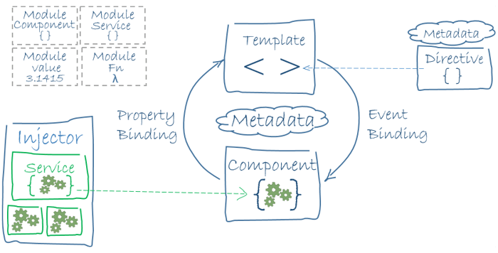

# Angular 아키텍처(Architecture)

 

Angular를 구성하는 아키텍처(Architecture)[^1]를 살펴보겠습니다.

- 모듈
- 부트스트래핑
- 컴포넌트
- 템플릿
- 메타데이터
- 데이터 바인딩
- 디렉티브
- 파이프
- 서비스 / 의존성 관리
- 라우팅
- ...

 

---

[^1]: 프레임워크의 근간이 되는 개념 및 운영 구조를 말합니다. [Wiki 참고](https://ko.wikipedia.org/wiki/%EC%BB%B4%ED%93%A8%ED%84%B0_%EA%B5%AC%EC%A1%B0)