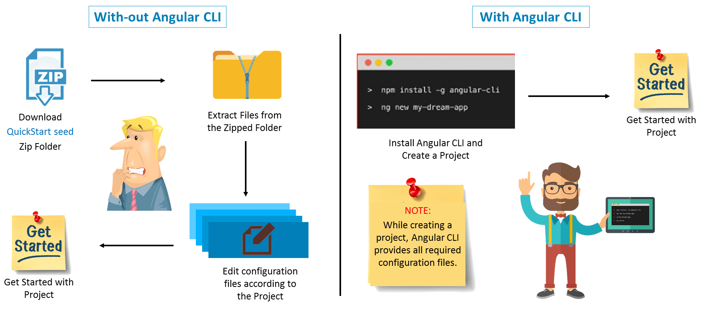

# Angular CLI

일반적으로 Framework를 도입할 때 가장 힘든 점 중 하나가 개발환경 구축입니다. 프로젝트 디렉토리 구조를 고려해서 구성해야 하고, 기본적으로 사용되는 설정 파일들도 다수 존재합니다. 구성을 파악하는 것부터가 쉽지 않습니다. 코드를 작성한 후 빌드, 번들링, 테스팅, 배포 등등 해야 할 일이 너무나 많고 설정 방법 또한 복잡해 프레임워크 사용을 기피하기도 합니다.

이러한 고민을 해결하기 위한 방편으로 대다수 모던 프레임워크는 CLI 도구를 제공합니다. Angular 또한 마찬가지입니다. \[Angular CLI\]\[5\]는 [Angular](https://angular.io) 애플리케이션을 초기화, 개발, 스캐폴딩 및 유지 관리를 도와주는 매우 편리한 도구입니다.

\[\]\[5\]

Angular CLI를 사용하지 않을 때\(왼쪽\)와 사용할 때\(오른쪽\), 프로젝트 시작을 위해 요구되는 프로세스를 인포그래픽으로 살펴보면 쉽게 이해할 수 있을 겁니다. 중요한 건 복잡한 절차가 단순해진다는 것입니다.



## angular 설치

Angular CLI를 설치하기 위해 다음 명령을 입력합니다. [Node.js](https://nodejs.org), [NPM](https://npmjs.com) 등이 운영체제에 설치되어 있어야 합니다.

```bash
$ npm i -g @angular/cli
```

## angular 버전

`ng` 명령어 뒤에 `-v` 옵션을 붙여 실행하면, Angular 버전 정보가 출력됩니다.

```bash
$ ng -v
```

```bash
     _                      _                 ____ _     ___
    / \   _ __   __ _ _   _| | __ _ _ __     / ___| |   |_ _|
   / △ \ | '_ \ / _` | | | | |/ _` | '__|   | |   | |    | |
  / ___ \| | | | (_| | |_| | | (_| | |      | |___| |___ | |
 /_/   \_\_| |_|\__, |\__,_|_|\__,_|_|       \____|_____|___|
                |___/


Angular CLI: 6.0.0
Node: 8.11.1
OS: darwin x64
Angular:
...

Package                      Version
------------------------------------------------------
@angular-devkit/architect    0.6.0
@angular-devkit/core         0.6.0
@angular-devkit/schematics   0.6.0
@schematics/angular          0.6.0
@schematics/update           0.6.0
rxjs                         6.1.0
typescript                   2.7.2
```

## angular 도움말

`ng` 명령어 뒤에 `-h` 옵션을 붙여 실행합니다. 사용 가능한 명령 목록을 확인할 수 있습니다.

```bash
$ ng -h
```

```text
사용 가능한 명령:
  add         라이브러리를 프로젝트에 추가
  new         새로운 디렉토리에 신규 angular 프로젝트 생성
  generate    설계도(schematic)를 기반을 파일을 생성/수정
  update      애플리케이션, 의존성 모듈 업데이트
  build       아웃풋(기본 값: dist) 경로에 앱을 빌드
  serve       파일 변경 시, 앱을 빌드하고 서브(serve)
  test        유닛 테스트 실행
  e2e         e2e 테스트 실행
  lint        코드 린트 수행
  xi18n       소스 코드에서 i18n 메시지 추출
  run         설계 타겟(Architect targets)을 실행
  eject       일시적으로 중지
  config      구성(configuration) 값을 읽고 쓰기
  help        도움말
  version     Angular CLI 버전 출력
  doc         키워드로 공식 Angular API 문서 열기

각 명령 사용에 대한 자세한 도움말은 "ng [command name] --help" 코드를 통해 살펴보세요.
```

## angular 프로젝트 생성

`ng new` 명령어 뒤에 `<프로젝트-이름>` 입력 후 실행합니다. 개발에 필요한 의존 모듈들을 다운로드 받기 때문에 적지 않은 시간이 소요됩니다. 의존 모듈을 설치하지 않고 프로젝트 스케폴딩 하길 원한다면 `--skip-install` 옵션을 추가해 설치합니다.

```bash
# ng new <프로젝트-이름>
$ ng new ng6project

# 의존 모듈을 설치하지 않고 스캐폴딩
$ ng new ng6project --skip-install
```

생성된 프로젝트 스캐폴딩 구조는 다음과 같습니다. 이와 같은 구조와 코딩 컨벤션이 **Angular 프레임워크 프로젝트의 표준 구조**입니다.

```bash
.
├── README.md
├── angular.json
├── e2e/
├── node_modules/
├── package-lock.json
├── package.json
├── src/
│   ├── app/
│   │   ├── app.component.css
│   │   ├── app.component.html
│   │   ├── app.component.spec.ts
│   │   ├── app.component.ts
│   │   └── app.module.ts
│   ├── assets/
│   ├── browserslist
│   ├── environments/
│   │   ├── environment.prod.ts
│   │   └── environment.ts
│   ├── favicon.ico
│   ├── index.html
│   ├── karma.conf.js
│   ├── main.ts
│   ├── polyfills.ts
│   ├── styles.css
│   ├── test.ts
│   ├── tsconfig.app.json
│   ├── tsconfig.spec.json
│   └── tslint.json
├── tsconfig.json
└── tslint.json
```

## angular 프로젝트 버전

프로젝트 디렉토리 위치에서 버전 출력 명령을 실행해보면 프로젝트에 설치된 패키지 정보를 확인할 수 있습니다.

```bash
# ng6project 디렉토리로 이동
$ cd ng6project

# 프로젝트 버전 출력
$ ng -v
```

```text
     _                      _                 ____ _     ___
    / \   _ __   __ _ _   _| | __ _ _ __     / ___| |   |_ _|
   / △ \ | '_ \ / _` | | | | |/ _` | '__|   | |   | |    | |
  / ___ \| | | | (_| | |_| | | (_| | |      | |___| |___ | |
 /_/   \_\_| |_|\__, |\__,_|_|\__,_|_|       \____|_____|___|
                |___/


Angular CLI: 6.0.5
Node: 8.11.1
OS: darwin x64
Angular: 6.0.3
... animations, common, compiler, compiler-cli, core, forms
... http, language-service, platform-browser
... platform-browser-dynamic, router

Package                           Version
-----------------------------------------------------------
@angular-devkit/architect         0.6.5
@angular-devkit/build-angular     0.6.5
@angular-devkit/build-optimizer   0.6.5
@angular-devkit/core              0.6.5
@angular-devkit/schematics        0.6.5
@angular/cli                      6.0.5
@ngtools/webpack                  6.0.5
@schematics/angular               0.6.5
@schematics/update                0.6.5
rxjs                              6.2.0
typescript                        2.7.2
webpack                           4.8.3
```

## angular 프로젝트 실행

Angular 라이브 개발 서버\(`localhost:4200`\)가 실행됩니다. 기본 웹 브라우저로 바로 실행시키려면 `--open` 옵션을 명령에 추가합니다. 라이브 개발 서버가 실행된 이후, 소스 파일을 수정/저장하면 자동으로 애플리케이션 페이지가 새로고침 됩니다.

```bash
# 라이브 개발 서버 구동
# http://localhost:4200/
$ ng serve

# 라이브 개발 서버 구동 후, 기본 웹 브라우저로 바로 실행
$ ng server --open
```

```bash
** Angular Live Development Server is listening on localhost:4200, open your browser on http://localhost:4200/ **

Date: 2018-03-21T01:55:17.246Z
Hash: 858b7f2d0c859f625db8
Time: 9050ms
chunk {main} main.js, main.js.map (main) 10.7 kB [initial] [rendered]
chunk {polyfills} polyfills.js, polyfills.js.map (polyfills) 227 kB [initial] [rendered]
chunk {runtime} runtime.js, runtime.js.map (runtime) 5.22 kB [entry] [rendered]
chunk {styles} styles.js, styles.js.map (styles) 15.6 kB [initial] [rendered]
chunk {vendor} vendor.js, vendor.js.map (vendor) 3.39 MB [initial] [rendered]
ℹ ｢wdm｣: Compiled successfully.
```

## angular 프로젝트 번들링

빌드 또는 개발 과정에서 `--prod` 옵션을 사용해 uglify, tree-shaking 된 번들링을 수행할 수 있습니다.

```bash
# 개발
$ ng serve --prod

# 빌드
$ ng build --prod
```

추가적으로 Angular CLI에 대한 자세한 사용법은 [Angular CLI](https://github.com/angular/angular-cli/wiki) Wiki를 참고해보세요.

\[5\]: [https://cli.angular.io/](https://cli.angular.io/)

