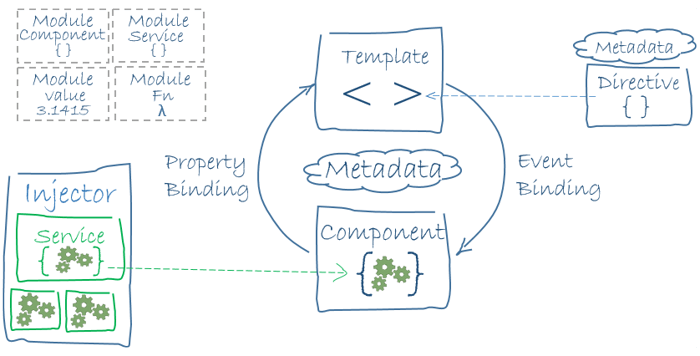

# Angular 아키텍쳐

Angular를 구성하는 아키텍처\(Architecture\)를 살펴보겠습니다.

* 모듈
* 부트스트래핑
* 컴포넌트
* 템플릿
* 메타데이터
* 데이터 바인딩
* 디렉티브
* 파이프
* 서비스 / 의존성 관리
* 라우팅
* ...


아키텍처에 대한 자세한 내용은 [Angular - Architecture](https://angular.io/guide/architecture)에서 살펴볼 수 있습니다.


