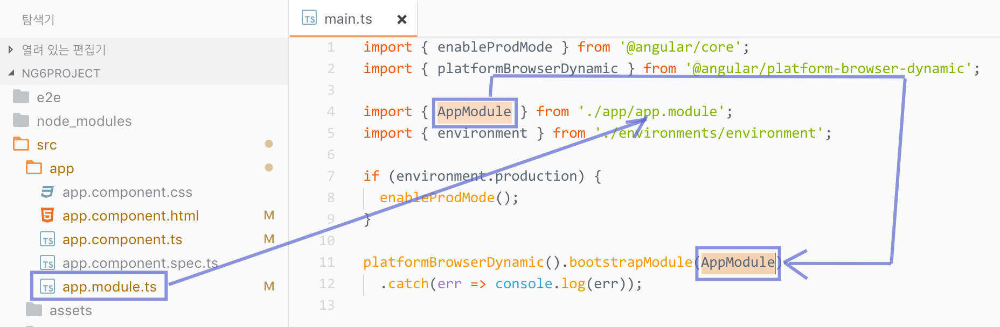
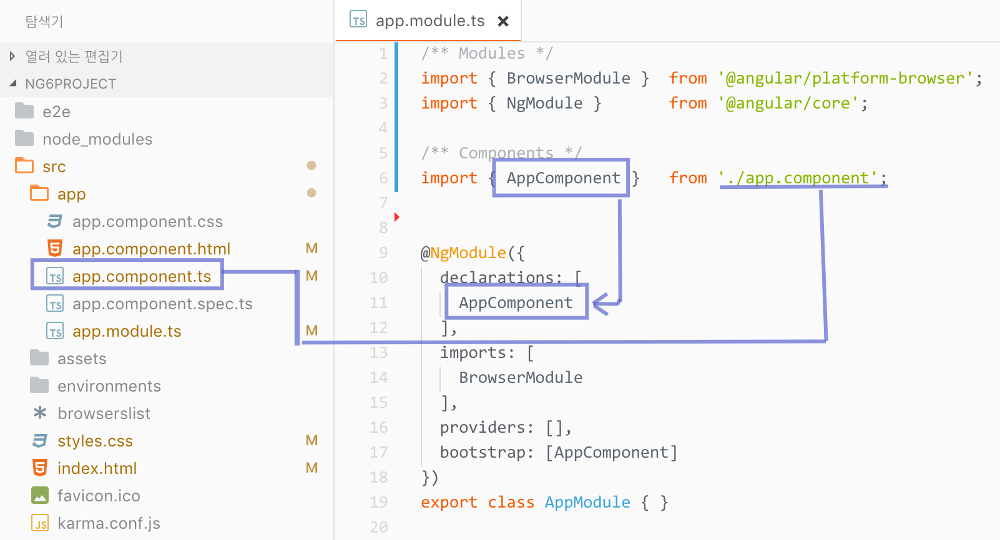
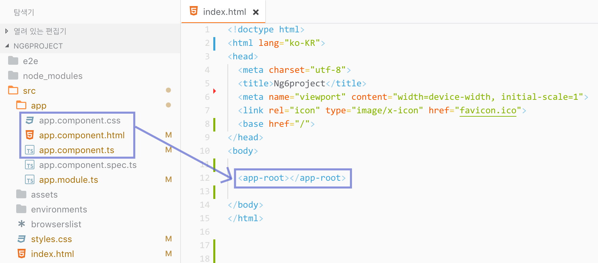

# 엔트리 포인트

프로젝트 루트 디렉토리에 위치한 HTML 파일은 애플리케이션의 인덱스 페이지에 해당됩니다. 필요한 경우 애플리케이션 개발에 필요한 리소스 등을 추가적으로 설정하거나 변경할 수 있습니다.



```markup
<!doctype html>
<html lang="ko-KR">
<head>
  <meta charset="utf-8">
  <title>Angular 6 아키텍쳐</title>
  <meta name="viewport" content="width=device-width, initial-scale=1">
  <link rel="icon" type="image/x-icon" href="favicon.ico">
  <base href="/">
</head>
<body>

  <!--
    Angular 프레임워크 라우팅을 통해 동적으로 페이지가 생성됩니다.
    <app-root> 뷰(View)에 대응하는 컴포넌트는 app.component.ts 파일입니다.
  -->
  <app-root></app-root>

</body>
</html>
```



## 루트 모듈\(Root Module\)

루트 디렉토리에 위치한 `/main.ts` 파일은 Angular 애플리케이션의 기본 엔트리 포인트입니다. JIT 컴파일러로 애플리케이션을 컴파일 한 후, 루트 모듈인\(`AppModule`\)을 부트스트랩 하여 웹 브라우저에서 실행합니다. 코드를 살펴보면 `AppModule` 파일을 불러와 부트스트랩 모듈에 설정합니다.



```typescript
import { enableProdMode }         from "@angular/core";
import { platformBrowserDynamic } from '@angular/platform-browser-dynamic';

// 루트 모듈 파일 `app/app.module.ts` 로드
import { AppModule }              from './app/app.module';
import { environment }            from './environments/environment';

if (environment.production) { enableProdMode() }

// AppModule을 불러들여 부트스트랩 모듈에 설정
platformBrowserDynamic().bootstrapModule(AppModule)
  .catch(err => console.log(err));
```



이해를 돕기 위한 그림을 살펴봅니다.

> `src/main.ts` ⬅︎ `src/app/app.module.ts`




**NOTE.**  
Angular CLI를 통해 스캐폴딩 된 프로젝트 구조는 이미 루트 모듈\(`AppModule`\)을 가지고 있습니다.  추가적으로 다른 모듈을 만들어 개발할 수도 있습니다.

모듈은 관련된 컴포넌트 들을 묶은 그룹을 말하며, 모듈이 모여 Angular 애플리케이션을 구성하게 됩니다. 간단한 애플리케이션이라면 루트 모듈만으로도 충분하지만, 복잡도가 높아질 수도록 모듈을 분류해서 관리하는 것이 좋습니다. \(기능 / 공유 모듈 등\)


## 부트스트래핑\(Bootstrapping\)

`main.ts` 파일로부터 호출되는 `app.module.ts` 모듈 파일은 `/app` 디렉토리 내에 위치해 있습니다. 코드를 살펴보면 `NgModule` 모듈을 불러와 `AppComponent` 컴포넌트를 선언, [부트스트래핑](https://angular.io/guide/bootstrapping) 합니다.



```typescript
// BrowserModule은 웹 브라우저를 위한 모듈
// 웹 애플리케이션 프로젝트일 경우, 반드시 로드해야 함.
import { BrowserModule } from '@angular/platform-browser';
import { NgModule }      from '@angular/core';

// 컴포넌트 로드
import { AppComponent }  from './app.component';

// NgModule 데코레이터에 메타데이터 설정
@NgModule({
  // 사용할 컴포넌트, 디렉티브, 파이프 등록
  //  컴포넌트를 "선언"에 추가해야 사용 가능
  declarations: [
    AppComponent
  ],
  // 필요한 모듈 등록
  //  예) BrowserModule, FormsModule, HttpModule 등
  imports: [
    // 브라우저 모듈
    BrowserModule
  ],
  // 서비스 등록
  //  이 곳에 등록된 서비스는 모든 컴포넌트에서 접근 사용 가능
  providers: [],
  // 부트스트래핑
  //  컴포넌트 트리를 구성하는 루트 컴포넌트 설정
  //  필요한 경우 2개 이상 설정 가능하지만,
  //  일반적으로 1개의 루트 컴포넌트 설정
  bootstrap: [AppComponent]
})
export class AppModule { }
```



이해를 돕기 위한 그림을 살펴봅니다.

> `src/app/app.module.ts` ⬅︎ `src/app/app.component.ts`



## 컴포넌트\(Components\)

`AppComponent` 컴포넌트는 `app.component.ts` 파일에 정의되어 있습니다. 코드를 살펴보면 컴포넌트 모듈을 불러와 메타데이터를 입력하고, 클래스로 컴포넌트를 내보냅니다. 여기서 내보내진 클래스는 `main.ts`에서 `AppComponent`로 불러와 사용됩니다.



```typescript
// 컴포넌트 데코레이트를 사용하기 위한 모듈 로드
import { Component } from '@angular/core';

// 컴포넌트 데코레이터에 메타데이터 설정
@Component({
  selector: 'app-root',                // <app-root> 커스텀 요소 이름
  templateUrl: './app.component.html', // HTML 템플릿 파일
  styleUrls: ['./app.component.css']   // CSS 스타일링 리스트
})
export class AppComponent {
  title = 'Angular 프론트엔드 애플리케이션';
}
```



컴포넌트 데코레이터에 설정된 메타데이터는 커스텀 요소 선택자, 템플릿, 스타일링 입니다.

* `seelctor`: 컴포넌트에서 사용할 커스텀 요소\(`<app-root>`\)의 이름입니다.
* `templateUrl`: 컴포넌트 템플릿 HTML파일의 경로를 설정합니다.
* `styleUrls`: 컴포넌트 스타일 CSS 파일 리스트\(배열\)로 각 파일의 경로를 설정합니다.

이해를 돕자면, 인덱스 페이지에 사용된 `<app-root>` 컴포넌트를 구성하는 파일의 위치는 다음과 같습니다.

> `src/index.html` ⬅︎ `src/app/app.component.{html,css,ts}`



