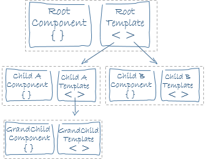

# 컴포넌트 통신

컴포넌트 세션에서 이야기 드린 것처럼 컴포넌트는 컴포넌트를 중첩할 수 있습니다. 이를 통해 부모 컴포넌트와 자식 컴포넌트 관계가 형성됩니다. 이전에 다룬 컴포넌트 데이터 바인딩은 컴포넌트 자체 내에서 데이터를 속성, 이벤트 바인딩 또는 디렉티브를 사용했었죠. 하지만 애플리케이션 뷰는 다수의 컴포넌트가 관계를 형성해 트리를 구성합니다.

즉, 하나의 컴포넌트로 애플리케이션을 개발하지 않는다는 것이죠. 그러므로 컴포넌트 간 통신에 대해 이해해야 합니다.

