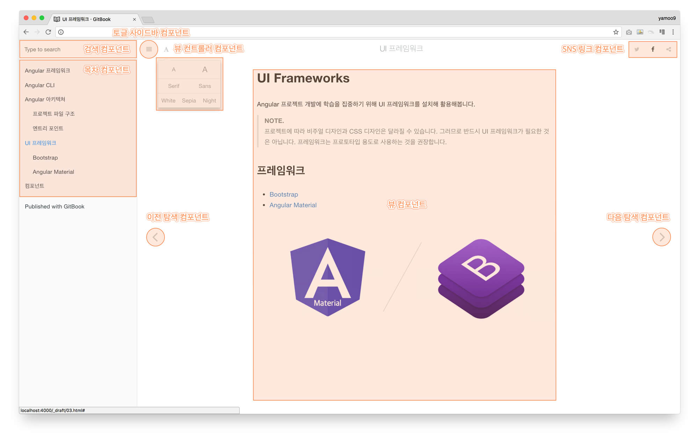

# 컴포넌트

컴포넌트는 페이지 화면 뷰\(View\)를 구성하는 작은 부품\(단위\) 입니다. 애플리케이션 화면이 하나의 뷰가 될 수도 있고, 애플리케이션 화면에 레이아웃 된 기능이나 목적에 따라 세부 뷰로 나뉘져 애플리케이션 화면을 구성할 수도 있습니다.

GitBook 애플리케이션 인터페이스 뷰를 살펴보면 좌측에 사이드바 뷰 컴포넌트와 우측에 메인 뷰 컴포넌트로 나뉩니다. 토글 사이드바 버튼 컴포넌트를 클릭하면 사이드바 뷰 컴포넌트는 토글\(Toggle\)할 수 있습니다. 뷰 컨트롤러 컴포넌트를 클릭하면 메인 뷰를 조작할 수 있는 다양한 버튼 컴포넌트를 화면에 표시하거나 감춥니다.

우측 상단에는 SNS 링크 컴포넌트가 배치되어 있어 GitBooK을 소셜 네트워크 상으로 공유할 수 있습니다. 그리고 사용자 편의를 위해 메인 뷰 양 옆에는 탐색 컴포넌트들이 배치되어 있습니다.

이렇듯 애플리케이션 인터페이스 화면은 여러 뷰로 나눠 구성됩니다. 즉, Angular 애플리케이션은 여러 개로 나눠진 뷰로 구성되며 각 뷰는 컴포넌트를 통해 만들어 집니다.



## 컴포넌트 계층 구조

각 컴포넌트는 독립적인 부품이지만, 컴포넌트가 다른 컴포넌트를 중첩할 수 있습니다. 컴포넌트를 HTML 요소라고 생각하면 이해하기 쉽습니다. 디비전\(Division\) 요소는 내부에 다른 디비전 요소를 중첩할 수 있죠. 중첩하게 되면 요소 사이에 부모와 자식이라는 관계가 형성됩니다.



```markup
<div class="parent">
  <div class="child"></div>
  <div class="child"></div>
</div>
```



마찬가지로 Angular 컴포넌트 또한 컴포넌트가 다른 컴포넌트를 중첩할 수 있습니다. 컴포넌트 역시 중첩되면 부모, 자식 관계가 형성됩니다.



```markup
<app-tabs>
  <app-tab></app-tab>
  <app-tab></app-tab>
</app-tabs>
```



컴포넌트 관계를 도표로 그려보면 다음과 같습니다. 모든 컴포넌트는 루트 컴포넌트로 부터 시작되며, 자식 컴포넌트가 종속됩니다. 컴포넌트가 관계된 모양이 나무 뿌리 모양과 같아 보이죠? 그래서 컴포넌트 간의 관계를 **컴포넌트 트리\(Components Tree\)**라고 부릅니다.



보다 자세한 내용은 [Angular - Introduction to Components](https://angular.io/guide/architecture-components)를 참고하세요.



