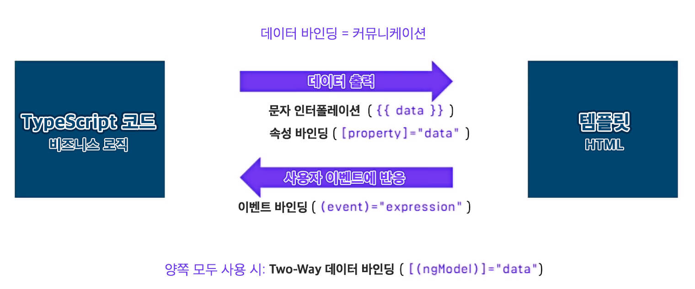

# 데이터 바인딩

컴포넌트와 템플릿을 컨트롤 하는 데이터 바인딩 메커니즘을 Angular는 제공합니다. 템플릿 HTML 파일에 데이터를 바인딩하는 마크업을 추가하면 템플릿과 컴포넌트를 Angular가 연결\(Binding\)하여 뷰\(View\)를 만들어 냅니다.

컴포넌트는 4가지 유형의 데이터 바인딩 구문을 제공합니다. 각 유형은 단방향\(One-Way\) 또는 양방향\(Two-Way\) 중 하나를 선택해 사용할 수 있습니다.

1.  보간법  : String Interpolation
2. \[속성\] 바인딩    : Property Binding
3. \(이벤트\) 바인딩   : Event Binding
4. \[\(양방향\)\] 바인딩 : Two-Way Data Binding

