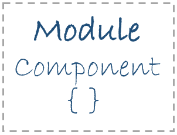

# 데코레이터 / 메타데이터

## 컴포넌트 데코레이터 {#component-decorator}

컴포넌트에 대해 이해하기 위해 간단한 버튼 컴포넌트를 만들어 보겠습니다. Angular 버튼 컴포넌트를 생성하기 위한 첫번째 과정은 먼저 `app/` 디렉토리 내부에 `button/` 디렉토리를 생성하는 것입니다.

이어서 `app/button/` 디렉토리 내부에 `button.component.ts` 파일을 생성하고, 생성된 파일 내부에 Angular 컴포넌트 데코레이터를 사용하기 위해 모듈을 불러옵니다. 이어서 컴포넌트 데코레이터 아래 `ButtonComponent` 클래스를 만듭니다.



```typescript
// 컴포넌트 데코레이터를 사용하기 위한 모듈 로드
import { Component } from "@angular/core";

// 컴포넌트 데코레이터
@Component()
export class ButtonComponent {
  // 버튼 컴포넌트 클래스
}
```



> **NOTE.**  
>  컴포넌트는 모듈에 종속되는 하나의 부품입니다.
>
> 

## 메타데이터 {#metadata}

메타데이터는 컴포넌트 데코레이터를 통해 컴포넌트 클래스를 어떻게 처리해야 할지 정보를 사용자가 Angular에 제공하는 것을 말합니다. 메타데이터로 기입 가능한 정보는 다양하지만, 기본적으로 선택자, 템플릿, 스타일을 설정합니다. 설정 방법은 아래 코드를 참고하세요.




```typescript
import { Component } from "@angular/core";

// 메타 데이터
const metadata:object = {
  selector    : 'app-button',
  templateUrl : 'app.component.html',
  styleUrls   : ['app.component.css']
};

@Component(metadata)
export class ButtonComponent {

}
```



