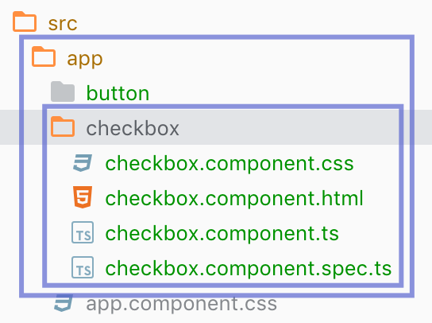
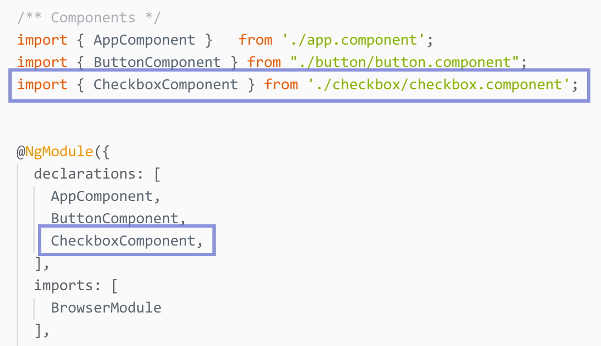

# 제너레이트 컴포넌트

Angular CLI는 Angular 컴포넌트를 보다 손쉽게 생성할 수 있도록 명령어를 제공합니다. 사용 방법은 다음과 같습니다.

```bash
# ng geterate component <컴포넌트-이름>
$ ng g c checkbox

CREATE src/app/checkbox/checkbox.component.css (0 bytes)
CREATE src/app/checkbox/checkbox.component.html (27 bytes)
CREATE src/app/checkbox/checkbox.component.spec.ts (642 bytes)
CREATE src/app/checkbox/checkbox.component.ts (277 bytes)
UPDATE src/app/app.module.ts (532 bytes)
```

명령이 실행된 결과, `app/checkbox` 디렉토리가 생성되고 내부에 4개의 파일\(`checkbox.component.{html,css,ts,sepc.ts}`\)이 생성되었고, `app.module.ts` 파일이 업데이트되었다고 안내합니다. 앞서 일일이 컴포넌트 제작에 필요한 파일들을 만들던 수고를 줄여줍니다.



뿐만 아니라 번거로웠던 `app.module.ts`에 컴포넌트를 자동 등록해주니 참 편리하죠!




**NOTE.**   
컴포넌트 생성 명령을 사용할 때 유닛테스트 spec.ts 파일을 생성하지 않으려면 --spec 옵션 값으로 false를 설정한 후 생성 명령을 실행하면 됩니다.

> ```bash
> # ng generate component <컴포넌트-이름>
> $ ng g c <컴포넌트-이름> --spec false
> ```

중첩된 컴포넌트\(컴포넌트 내부 컴포넌트\)를 생성 하려면 다음과 같이 명령을 처리합니다.

> ```bash
> $ ng g c <컴포넌트-이름>/<서브-컴포넌트-이름>
> ```

컴포넌트를 app 디렉토리에 바로 생성 하려면 --flat 옵션을 추가하여 명령을 실행합니다.

```bash
$ ng g c <컴포넌트-이름> --flat
```



