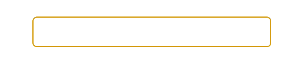

# HostBinding / HostListener

`@HostBinding`, `@HostListener` 데코레이터는 커스텀 디렉티브 제작에 유용하게 사용될 수 있습니다. `@HostBinding`을 사용하면 디렉티브를 호스팅 하는 요소 또는 컴포넌트의 속성을 설정할 수 있으며 `@HostListener`를 사용하면 호스트 요소나 컴포넌트에서 이벤트를 수신 할 수 있습니다.

2가지 데코레이터 모두 매우 직관적 입니다. 호스트에서 `keydown` 이벤트를 감지해 `color` 및 `border-color`를 변경하는 예제를 살펴보겠습니다.



```typescript
import { Directive, HostBinding, HostListener } from '@angular/core';

@Directive({ selector: '[data-rainbow]' })
export class RainbowDirective {

  colors:string[] = [
    'darksalmon', 
    'hotpink', 
    'lightskyblue', 
    'goldenrod', 
    'peachpuff', 
    'mediumspringgreen', 
    'cornflowerblue', 
    'blanchedalmond', 
    'lightslategrey'
  ];
  
  @HostBinding('style.color') color:string;
  @HostBinding('style.border-color') borderColor:string;
  
  @HostListener('keydown') newColor() {
    const pick = Math.floor(Math.random() * this.colors.length);
    this.color = this.borderColor = this.colors[pick];
  }
}
```



정의된 커스텀 디렉티브를 속성으로 설정된 요소는 `keydown` 이벤트가 감지되면 설정된 스타일이 변경됩니다.



```markup
<input type="text" data-rainbow>
```



작성된 결과는 다음과 같습니다. 인풋 요소에 텍스트를 입력할 때 마다 글자, 테두리 색상이 랜덤하게 변경됩니다.





**NOTE.**  
호스트의 모든 클래스 및 속성에 바인딩 가능합니다. 예시를 살펴보세요.

```typescript
@HostBinding ( 'class.active')
@HostBinding ( 'disabled')
@HostBinding ( 'attr.role')
```


