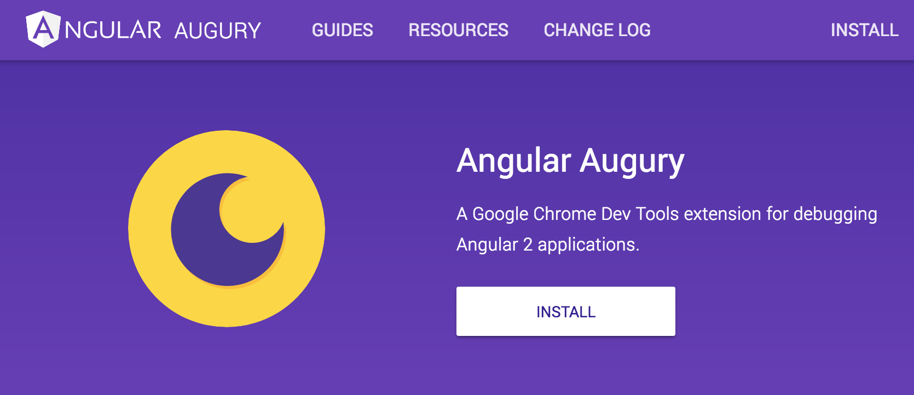
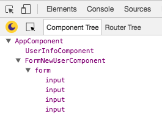

# 디버깅

## Angular Augury

[Angular Augury](https://augury.angular.io/)는 Angular 애플리케이션을 디버깅하고 프로파일링 하는데 가장 많이 사용되는 \[Chrome DevTools 확장 프로그램\(Extensions\)\]\[2\]입니다.

Angury를 사용하면 Angular 애플리케이션 개발 시, 컴포넌트 트리, 라우팅, 모듈 관계 구조 등 데이터를 시각화해서 사용자에게 보여줍니다. 이를 통해 개발자는 애플리케이션의 구조를 즉시 파악하고 탐지 할 수 있습니다.

## 가이드

Augury는 웹 브라우저에서 실행되는 Angular 애플리케이션 디버깅 도구입니다. 개발자 도구\(DevTools\) 패널에서 실행되며 개발 중 분석 및 디버깅을 돕습니다.

애플리케이션 구조와 빌딩된 블록 간의 관계에 대해 알기 쉽게 인포그래픽을 제공합니다.

* 컴포넌트\(Components\)
* 서비스\(Services\)
* 라우트\(Routes\)
* 모듈\(Modules\)
* 의존성 관리\(Dependencies\)
* 인젝터\(Injectors\)
* 데이터 바인딩\(Data bindings\)
* 이벤트\(Events\)
* 객체 속성\(properties\)

### Augury 기능

#### 1. 컴포넌트 트리

애플리케이션에 로드된 컴포넌트를 구조를 나타내는 트리를 표시합니다.

각 컴포넌트를 클릭하면 컴포넌트에 관한 정보를 제공합니다. Properties 탭을 클릭하면 다음과 같은 항목을 확인할 수 있습니다.

1. **View Source** - 컴포넌트 소스 코드 링크 제공
2. **Change Detection** - 컴포넌트 변경 감지가 되었는지 여부 표시
3. **Object Properties** - 컴포넌트 속성 리스트 표시
4. **Dependencies** - 컴포넌트의 종속 관계를 표시

#### 2. 소스맵

주의할 점은 소스맵 파일이 있을 경우에만, TypeScript 코드를 표시합니다. 배포\(Production\) 시에는 소스맵이 없기 때문에 TypeScript가 아닌, JavaScript 코드로 연결됩니다.

Injectors Graph 탭을 클릭하면 컴포넌트 및 서비스의 종속성을 화면에 그래프로 표시합니다.

#### 3. 라우터 트리

Augury의 또 다른 기능은 라우팅 정보를 표시하는 라우터 트리입니다. Router Tree 탭을 클릭하면 화면에 그래픽이 표시됩니다.

\[2\]: [https://chrome.google.com/webstore/detail/augury/elgalmkoelokbchhkhacckoklkejnhcd](https://chrome.google.com/webstore/detail/augury/elgalmkoelokbchhkhacckoklkejnhcd)

