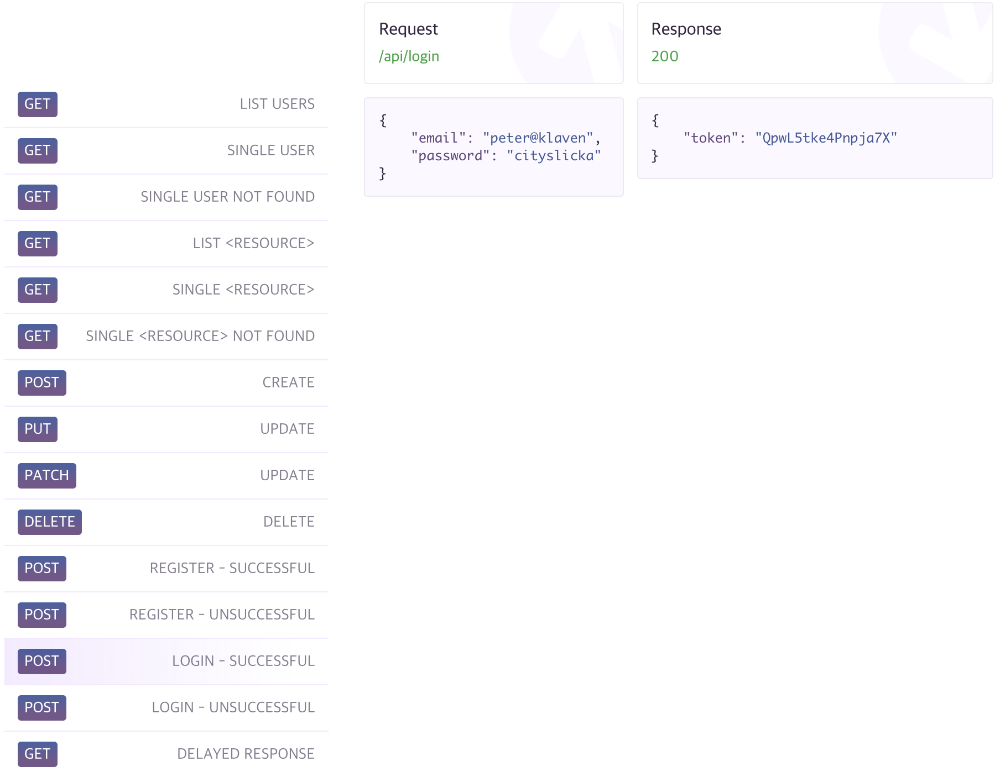

# REST API 테스트

[reqres.in](https://reqres.in/) 서비스를 이용해 REST API 테스트를 진행해보겠습니다. 



[CRUD](https://ko.wikipedia.org/wiki/CRUD) 사용법은 다음과 같습니다.

#### GET

```typescript
// 사용자 그룹(users) 리스트
this.http.get('https://reqres.in/api/users').subcribe()

// 사용자(user) :id
this.http.get('https://reqres.in/api/users/3')
```

#### POST

```typescript
// 사용자 추가
this.http.post('https://reqres.in/api/users')
```

#### PUT

```typescript
// 사용자 교체
this.http.put('https://reqres.in/api/users/4')
```

#### PATCH

```typescript
// 사용자 수정
this.http.patch('https://reqres.in/api/users/1')
```

#### DELETE

```typescript
// 사용자 수정
this.http.delete('https://reqres.in/api/users/2')
```

