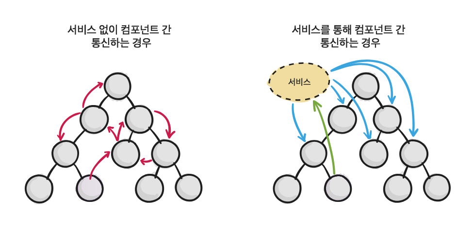

# 서비스 / 의존성 주입

Angular 애플리케이션을 개발할 때 여러 컴포넌트에서 동일한 코드를 사용해야 하는 상황이 발생할 가능성이 큽니다. 컴포넌트 간에 데이터를 공유해야 할 수도 있고, 데이터베이스에서 데이터를 가져와야 할 수도 있습니다.

컴포넌트 관계가 단순할 때는 컴포넌트 통신\(`@Input`, `@Output`\) 방법을 사용해 데이터 공유가 손쉽지만, 관계가 복잡해질 수록 방법이 복잡하고 어려워 집니다. 

예를 들어 컴포넌트 내부 중첩 단계\(Depth\)가 4단계일 경우, 최상위 컴포넌트에서 최하위 컴포넌트 까지 데이터를 공유 하려면 중간에 위치한 모든 컴포넌트에 `@Input`을 사용해 최하위 컴포넌트에 데이터를 전달해야 합니다. 상당히 복잡해지고, 불필요한 반복이 지속됩니다.



컴포넌트 간 통신에 불필요한 반복을 줄이고, 보다 손쉽게 데이터를 공유 하려면 Angular 서비스 사용이 필요합니다. 서비스는 다음과 같이 정의합니다. 코드를 살펴보면 `Injectable`을 불러온다는 점을 제외하고는 컴포넌트 코드와 상당히 유사합니다. `@Injectable` 데코레이터는 이 서비스와 관련된 메타 데이터를 내보내므로 Angular는 이 서비스에 다른 종속성을 주입\(DI: Dependency Injection\)해야 하는지 여부를 알 수 있습니다.



```typescript
import { Injectable } from '@angular/core';

// 컴포넌트에 주입(Injection) 하려면 
// @Injectable 데코레이터 사용이 요구됩니다.
@Injectable()
export class PopcornService {
  
  constructor() {
    console.log('팝콘 서비스가 주입되었습니다.');
  }
  
  cook(quantity:number):void {
    console.log('팝콘', quantity, '통이 조리되었습니다.');
  }
  
}
```



팝콘 서비스를 컴포넌트에 주입해 사용하는 방법은 다음 코드를 참고하세요.

```typescript
import { Component } from '@angular/core';

// 팝콘 서비스를 불러옵니다.
import { PopcornService } from './popcorn.service';

@Component({
  selector: 'app-root',
  templateUrl: './app.component.html',
  styleUrls: ['./app.component.css'],

  // 컴포넌트에 팝콘 서비스를 공급합니다.
  provides: [PopcornService]
})
export class AppComponent {

  // 생성자에 팝콘 서비스를 주입합니다.
  constructor(private popcornService:PopcornService) {}
  
  cookIt(quantity:number):void {
    // 팝콘 서비스 객체의 cook() 메서드를 실행합니다.
    this.popcornService.cook(quantity);
  }
  
}
```

컴포넌트 템플릿에서 `cookIt()` 메서드를 호출하면 컴포넌트 내부에서 팝콘 서비스를 사용합니다.

```markup
<label for="popcorn">팝콘</label>
<input id="popcorn" type="number" #quantity placeholder="조리할 팝콘 통 수 입력">
<button type="button" (click)="cookIt(quantity.value)">조리</button>
```

