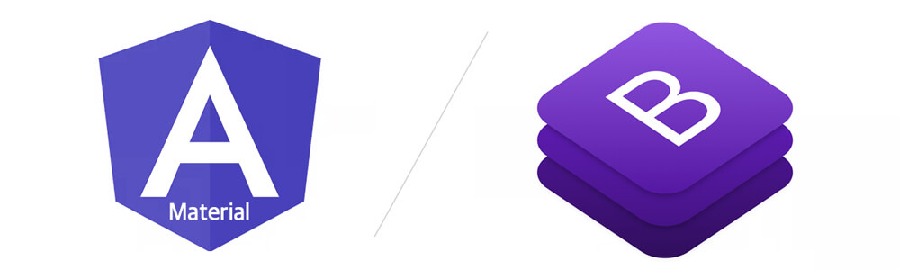

# UI 프레임워크

Angular 프로젝트 개발에 학습을 집중하기 위해 UI 프레임워크를 설치해 활용해봅니다.


프로젝트에 따라 비주얼 디자인과 CSS 디자인은 달라질 수 있습니다. 그러므로 반드시 UI 프레임워크가   
필요한 것은 아닙니다. 프레임워크는 프로토타입 용도로 사용하는 것을 권장합니다.


## 프레임워크

Angular와 함께 사용하면 좋을 UI 프레임워크는 다음과 같습니다.

* [Bootstrap](https://getbootstrap.com)
* [Angular Material](https://material.angular.io)

