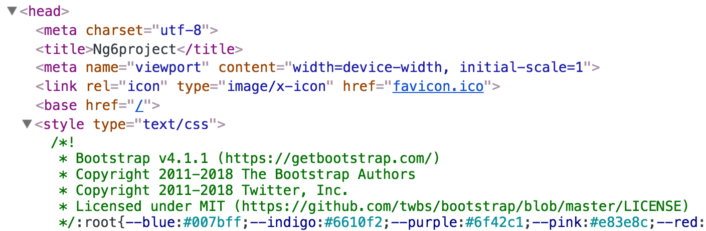

# Bootstrap

CSS 프레임워크 중 가장 인지도가 높은 [Bootstrap 프레임워크](https://getbootstrap.com/)를 설치해봅니다.

```bash
# npm install --save bootstrap
$ npm i bootstrap
```

설치가 완료되면 `package.json` 파일에 다음과 같이 추가됩니다.



```javascript
{
  ...
  "dependencies": {
    "bootstrap": "^4.1.1",
  }
}
```



설치된 Bootstrap 프레임워크 경로\(`node_modules/bootstrap`\)에서 배포된 `bootstrap.min.css` 파일을 `angular.json` 파일 `styles` 항목에 추가합니다.



```javascript
"styles": [
  "node_modules/bootstrap/dist/css/bootstrap.min.css",
  "src/styles.css"
],
```



설정이 완료되면 라이브 개발 서버를 구동해 Bootstrap 프레임워크가 정상적으로 로드되었는지 확인할 수 있습니다.

```bash
$ ng serve --open
```

웹 브라우저 DevTools를 열어 Elements 패널을 확인해보면 Bootstrap이 출력됩니다. \(이미지 참고\)




Bootstrap을 사용하는 방법은 [Documentation](https://getbootstrap.com/docs/4.1/getting-started/introduction/)을 참고하시길 바랍니다.


## Bootstrap Sass 사용 시

`src/style.sass` 파일 내부 상단에 다음과 같이 입력합니다. `~bootstrap`은 `node_modules/bootstrap` 경로를 가리킵니다. `scss` 디렉토리 내부에 위치한 `bootstrap.scss` 파일을 불러들이면 모든 컴포넌트에서 Bootstrap을 사용할 수 있습니다.

```css
@import "~bootstrap/scss/bootstrap.scss"
```

